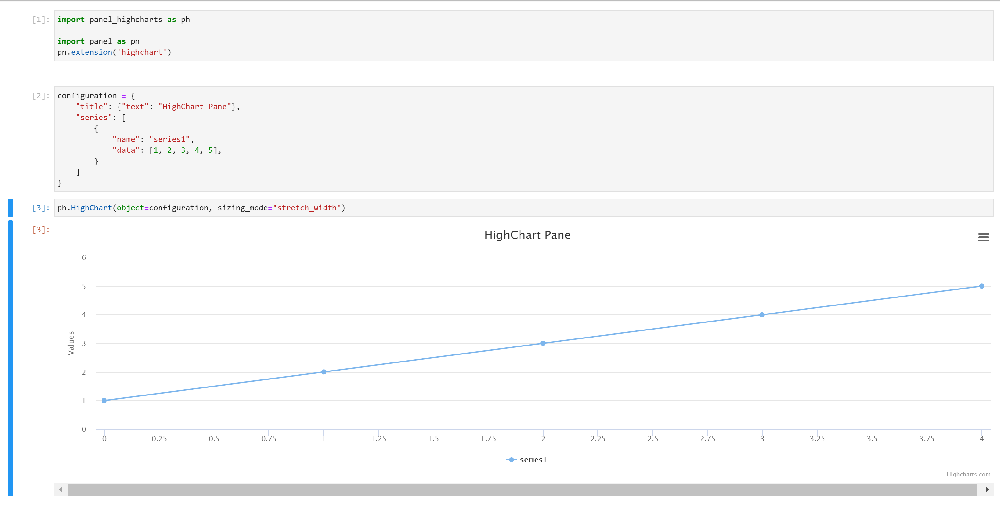

# &#128200; Panel HighCharts

The `panel-highcharts` package makes it easy to use [Highcharts](https://www.highcharts.com/) from Python for exploratory analysis in a Jupyter Notebook or as a [Panel](https://panel.holoviz.org) Web App.

Check out the `panel-highcharts` examples on **Binder**

| Jupyter Notebook | Jupyter Labs | Panel Apps |
| - | - | - |
| [](https://mybinder.org/v2/gh/marcskovmadsen/panel-highcharts/HEAD?filepath=examples) | [](https://mybinder.org/v2/gh/marcskovmadsen/panel-highcharts/HEAD?urlpath=lab/tree/examples) | [](https://mybinder.org/v2/gh/marcskovmadsen/panel-highcharts/HEAD?urlpath=panel) |

[](https://mybinder.org/v2/gh/marcskovmadsen/panel-highcharts/HEAD?urlpath=lab/tree/examples/HighChart.ipynb)

THIS IS APLHA SOFTWARE. I BELIEVE THINGS WORK, BUT THE PACKAGE NEEDS TO BE USED TO TELL. AND USAGE MIGHT ALSO CHANGE THE API.

## License

The `panel-highcarts` python package and repository is open source and free to use (MIT License), however **Highcharts itself requires a license for commercial use**. For more info see the Highcharts license [FAQs](https://shop.highsoft.com/faq).

## Installation

With `pip`

```bash
pip install panel-highcharts
```

## Usage

From with a Jupyter Notebook

```python
import panel_highcharts as ph

import panel as pn
pn.extension('highchart')
```

```python
configuration = {
    "title": {"text": "HighChart Pane"},
    "series": [
        {
            "name": "series1",
            "data": [1, 2, 3, 4, 5],
        }
    ]
}
```

```python
ph.HighChart(object=configuration, sizing_mode="stretch_width")
```



## Reference Guide

- [HighChart Reference Guide](https://github.com/MarcSkovMadsen/panel-highcharts/blob/main/examples/HighChart.ipynb)

[](https://mybinder.org/v2/gh/marcskovmadsen/panel-highcharts/HEAD?urlpath=lab/tree/examples/HighChart.ipynb)

https://github.com/marcskovmadsen/panel-highcharts/blob/HEAD/examples/HighChart.ipynb

## Examples

- [Networkgraph](https://github.com/MarcSkovMadsen/panel-highcharts/blob/main/examples/Network.ipynb)

[](https://mybinder.org/v2/gh/marcskovmadsen/panel-highcharts/HEAD?urlpath=lab/tree/examples/Network.ipynb)

## Additional Resources

You can find more inspiration via the links below.

- [Highcharts](https://www.highcharts.com/blog/products/highcharts/)
  - [Demos](https://www.highcharts.com/demo)
  - [API docs](https://api.highcharts.com/highcharts/)
- [Panel](https://panel.holoviz.org)
- [Awesome Panel](https://awesome-panel.org)

## Roadmap

When I get the time I would like to

- Add more examples
- Add badges for 100% test coverage etc.
- Distribute as conda package
- Support [HighStock](https://www.highcharts.com/demo/stock)
- Support [HighMap](https://www.highcharts.com/demo/maps)
- Support [HighGantt](https://www.highcharts.com/blog/products/gantt/)
- Support [HighEditor](https://www.highcharts.com/products/highcharts-editor/)
- Support pandas `.plot` api via method as `highplot` on dataframes

## Change Log

- 20210404: Can now display in Classic Notebook
- 20210403: First Release to PyPi. Works in Jupyter Lab and Panel App.
